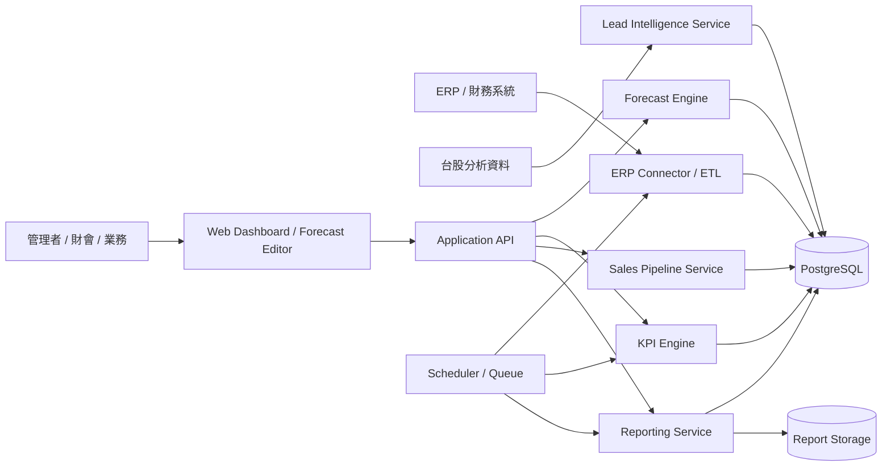

# 戰情室完整計劃書

## 1. 計劃摘要

本計劃目標是建立一套公司級經營戰情室，讓管理層可以以未來五年 forecast 為經營基準，持續比對 ERP 實績、業務 pipeline 與潛在客戶開發進度，並固定產出月報、季報、年報。

這套系統不是單純的 dashboard，而是一個可編修 forecast、可追蹤 KPI、可管理缺口、可排程報表的決策平台。第一版應優先解決三件事：

- forecast 能被維護、版本化、追蹤差異
- ERP 實績能穩定匯入並重算 KPI
- 經營報表能固定輸出並支撐管理會議

## 2. 專案目標

### 商業目標

- 建立單一經營指揮基準，避免各部門用不同版本的 forecast。
- 讓管理層即時看到實績達成率與年度缺口。
- 將 forecast 缺口轉化為業務 pipeline 與潛在客戶開發任務。
- 降低月報、季報、年報的人工作業成本與口徑落差。

### 系統目標

- 支援五年 forecast 編修與 scenario 管理。
- 與 ERP 串接，持續匯入 actuals。
- 自動計算 KPI、差異、達成率、pipeline coverage。
- 整合台股分析資料，輔助找出潛在客戶。
- 定時輸出月報、季報、年報。

## 3. 範圍定義

### In Scope

- 五年 forecast 管理
- 多 scenario 版本
- ERP 實績匯入
- KPI 計算與 dashboard
- 業務 pipeline 與缺口管理
- 潛在客戶清單與潛力分數
- 月報、季報、年報排程輸出
- 權限、稽核、操作紀錄

### Out of Scope for MVP

- 全集團多國多帳套一次上線
- 完整 CRM 取代既有系統
- AI 自動生成完整 forecast
- 逐筆即時串流 ERP 同步
- 高度自助式報表設計器

## 4. 主要使用者

- `CEO / GM`
  - 看整體 KPI、差異、風險、缺口與行動方案
- `CFO / 財會主管`
  - 維護 forecast、確認口徑、產出經營報表
- `業務主管`
  - 檢視 pipeline coverage、管理商機、補足 forecast 缺口
- `IT / 資料管理者`
  - 維護 ERP 串接、欄位對應、排程與權限

## 5. 核心需求

### 5.1 Forecast 管理

- 以五年 forecast 作為經營基準
- 支援年 / 季 / 月三層期間
- 支援 BU、產品線、地區、客群等維度
- 支援 Base、Stretch、Conservative、自訂 Scenario
- 支援批次調整、複製版本、driver-based 調整
- 保留每次修改人、修改時間、修改內容

### 5.2 ERP 串接與 KPI

- 從 ERP 匯入訂單、出貨、開票、應收、回款、成本、費用、存貨
- 建立 mapping layer 把 ERP 口徑轉成戰情室 metric
- 自動計算：
  - 營收達成率
  - 毛利率
  - 費用率
  - EBITDA
  - 現金回收率
  - 應收週轉
  - 存貨週轉
  - Pipeline coverage

### 5.3 業務與潛在客戶

- Forecast 缺口可直接對應到 pipeline 缺口
- 支援現有客戶、潛在客戶、商機、預估成交月份、機率、預估收入
- 可整合台股分析資料做潛力客戶排序
- 支援從推薦名單轉成開發任務

### 5.4 報表與排程

- 自動產出月報、季報、年報
- 報表包含：
  - Actual vs Forecast
  - KPI 達成率
  - 差異分析
  - 業務 pipeline
  - 潛力客戶
  - 風險與行動項
- 支援 Web 查看、PDF 匯出、Excel 匯出、Email 發送

## 6. 建議系統架構

### 6.1 技術選型建議

- 前端：`Next.js + TypeScript`
- UI 元件：`Tailwind CSS + headless component library`
- 後端：`Next.js API routes` 或 `Node.js domain services`
- 資料庫：`PostgreSQL`
- ORM：`Prisma`
- 排程與背景工作：`BullMQ + Redis`
- 檔案輸出：`S3-compatible storage`
- 驗證與權限：`SSO / Google Workspace / Microsoft Entra ID` 擇一
- 監控：`OpenTelemetry + application logs + job logs`

### 6.2 邏輯架構

### 6.3 模組分層

- `Presentation Layer`
  - Dashboard
  - Forecast 編輯器
  - KPI 與差異頁
  - 業務缺口頁
  - 報表中心
- `Application Layer`
  - Forecast Service
  - KPI Service
  - Sales Pipeline Service
  - Lead Intelligence Service
  - Reporting Service
- `Integration Layer`
  - ERP Connector
  - 台股資料匯入器
  - Email Sender
- `Data Layer`
  - PostgreSQL
  - Job Queue
  - Report Storage

## 7. 功能模組設計

### 7.1 Dashboard 首頁

- 本月 / 本季 / 本年 KPI 卡片
- Forecast vs Actual 趨勢圖
- 差異熱區矩陣
- Pipeline coverage 指標
- 潛力客戶推薦榜
- 風險清單與待辦事項

### 7.2 Forecast 編輯器

- 試算表風格輸入
- 支援 scenario 切換
- 支援按 BU / 產品線 / 地區過濾
- 支援成長率批次套用
- 支援 driver-based 重算
- 支援版本比對與差異檢視

### 7.3 KPI 與差異中心

- 各 KPI 本期值、目標值、達成率
- Actual 與 Forecast 差異排行
- 紅黃綠燈狀態
- 支援 drill-down 到 BU / 產品線 / 客戶群

### 7.4 業務與缺口管理

- 年度目標缺口
- weighted pipeline
- committed revenue
- pipeline coverage
- 潛在客戶推薦
- 商機清單與成交預估

### 7.5 報表中心

- 月報模板
- 季報模板
- 年報模板
- 報表排程
- 執行記錄
- 匯出與寄送記錄

## 8. 資料架構

核心資料物件如下：

- `scenario`
- `forecast_line`
- `forecast_driver`
- `actual_line`
- `kpi_definition`
- `kpi_result`
- `account_mapping`
- `customer`
- `opportunity`
- `lead_signal`
- `report_job`

詳細欄位定義請參考：

- [戰情室資料模型](/Users/cph/codexBOT/docs/war-room-data-model.md:1)

## 9. 關鍵資料流程

### 流程 A：Forecast 維護

1. 使用者建立或複製 scenario
2. 編輯 revenue、gross profit、opex 等 forecast lines
3. 系統即時重算 roll-up 結果
4. 發布為新的經營基準版本

### 流程 B：ERP 實績同步

1. Job scheduler 觸發 ERP connector
2. ERP 資料寫入 staging
3. Mapping layer 轉為標準 actuals
4. KPI engine 重算 achievement 與 variance
5. Dashboard 與報表資料集更新

### 流程 C：Forecast 缺口轉成業務行動

1. KPI engine 算出目標缺口
2. Sales pipeline service 計算 weighted pipeline
3. 系統比對 coverage 是否不足
4. Lead intelligence service 推薦潛力客戶
5. 業務主管建立開發任務或商機

### 流程 D：固定產報

1. 月底 / 季底 / 年底排程啟動
2. 報表服務讀取 KPI、variance、pipeline、lead data
3. 套用報表模板
4. 產出 PDF / Excel
5. 寄送給指定名單並保留紀錄

## 10. KPI 設計原則

- KPI 公式不可寫死在前端
- KPI 要可依公司、BU、產品線、地區、期間重算
- KPI 需保留 target、actual、variance、achievement rate
- KPI 門檻值需可設定紅黃綠燈

建議第一批 KPI：

- Revenue Achievement
- Gross Margin
- Opex Ratio
- EBITDA
- Cash Collection Rate
- AR Turnover
- Inventory Turnover
- Pipeline Coverage

## 11. 權限與治理

### 權限角色

- `Admin`
  - 管理使用者、權限、資料來源、mapping
- `Finance Editor`
  - 維護 forecast、檢視 KPI、產出報表
- `Sales Manager`
  - 管理商機、檢視缺口與推薦客戶
- `Viewer`
  - 僅查看 dashboard 與報表

### 治理要求

- 所有 forecast 修改都需寫 audit log
- 報表輸出需保留版本與產出時間
- ERP 匯入需保留 batch id
- KPI 口徑變更需有設定紀錄

## 12. 非功能需求

- 頁面載入時間：主要 dashboard 在一般資料量下 3 秒內
- 匯入可靠性：ERP 匯入失敗需可重跑
- 可追溯性：所有 forecast、匯入、報表都可追蹤
- 安全性：登入、角色權限、敏感資料控管
- 可維運性：有 log、job status、錯誤通知

## 13. 建議開發分期

### Phase 0：需求與口徑確認

時間：`1-2 週`

交付：

- KPI 清單與公式定稿
- ERP 欄位盤點
- Forecast 維度定稿
- 報表模板盤點

### Phase 1：Forecast 核心與 Dashboard

時間：`3-4 週`

交付：

- scenario 管理
- forecast editor
- 基礎 dashboard
- audit log

### Phase 2：ERP 串接與 KPI Engine

時間：`3-4 週`

交付：

- ERP connector
- actuals 標準化
- KPI 重算服務
- actual vs forecast 分析頁

### Phase 3：業務模組與缺口管理

時間：`3-4 週`

交付：

- customer / opportunity 模組
- pipeline coverage
- 缺口追蹤
- 潛在客戶清單

### Phase 4：報表中心與上線

時間：`2-3 週`

交付：

- 月報 / 季報 / 年報排程
- PDF / Excel 輸出
- Email 發送
- UAT 與正式上線

### 總工期建議

- `12-16 週` 完成第一版可上線系統

## 14. 人力配置建議

- `1` 位產品 / 專案負責人
- `1` 位財務口徑 owner
- `1` 位 ERP / 資料整合工程師
- `1-2` 位全端工程師
- `1` 位 QA / UAT 協調

如果資源有限，可由：

- `1` 位全端
- `1` 位資料整合
- `1` 位兼任 PM / 財務窗口

先做 MVP。

## 15. 風險與因應

### 風險 1：KPI 公式與部門口徑不一致

- 因應：Phase 0 先把公式定稿，系統化配置，不寫死。

### 風險 2：ERP 資料品質不穩

- 因應：先做 staging 與 mapping 驗證，再進正式 actuals。

### 風險 3：Forecast 維度太細導致維護成本過高

- 因應：MVP 先限縮到核心 BU / 產品線。

### 風險 4：台股分析資料來源品質與授權不明

- 因應：先用公開資料做 MVP，商業資料源第二階段再導入。

### 風險 5：報表樣式變更多

- 因應：先收斂固定模板，避免第一版就做通用報表編輯器。

## 16. MVP 上線建議

第一版上線建議只包含：

- 單一公司別
- 單一 ERP 來源
- Forecast scenario 管理
- 核心 KPI
- Dashboard
- 月報

這樣可以先驗證：

- 口徑是否一致
- 管理層是否真的使用
- Forecast 與實績差異是否能驅動業務行動

## 17. 立即決策事項

在正式開發前，需要先定以下事項：

- ERP 名稱、版本、連線方式
- Forecast 維度粒度
- KPI 正式清單與公式
- 台股資料來源策略
- 報表模板來源
- 使用者登入方式

## 18. 本計劃的開發輸出物

若依本計劃執行，最終交付物應包含：

- 戰情室 Web 系統
- Forecast 編輯器
- ERP 同步服務
- KPI engine
- 商機與潛力客戶模組
- 月報 / 季報 / 年報服務
- 權限與稽核機制
- 系統操作手冊

## 19. 補充文件

- [戰情室產品規格](/Users/cph/codexBOT/docs/war-room-prd.md:1)
- [戰情室資料模型](/Users/cph/codexBOT/docs/war-room-data-model.md:1)
